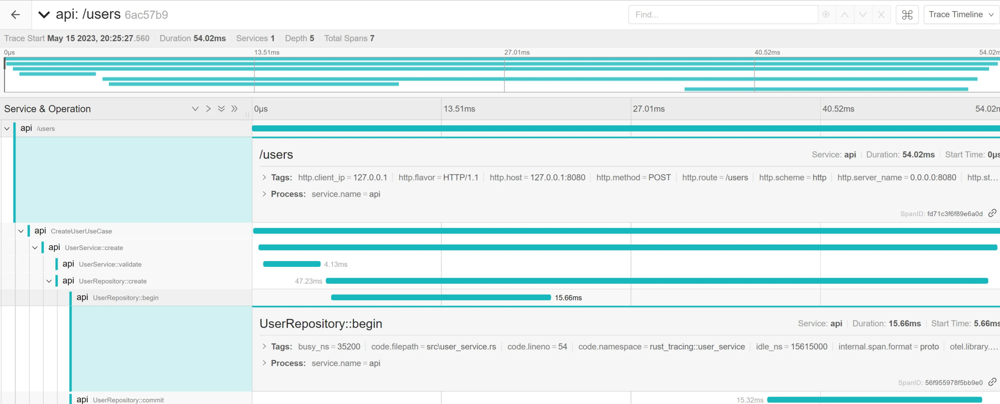

# rust-opentelemetry-example
This repository contains the code for a Rust application that demonstrates the concept of 
observability. The application is a compact Actix REST API with three endpoints: `/healthz` 
for health checks, `/metrics` for observability data, and `/users` for user-related operations. 
The application is designed to be transparent and comprehensible, making it easier to maintain, 
upgrade, and evolve over time.

## Observability
Observability is a term borrowed from control theory that refers to how well the internal states 
of a system can be understood based on its external outputs. It is crucial for debugging, 
understanding performance, and understanding control flow. Observability isn't just about monitoring 
your application's health; it's about illuminating the intricate paths of your system's behavior.

## Logs & Traces
Logs are timestamped records of events that happened in a system. They provide detailed context 
around what your application is doing and how it is performing. Traces, on the other hand, are a 
way to track a request as it propagates through various microservices and functions in your system.

## Metrics
Metrics are numerical data that represent the state of a system at a particular point in time. 
They can be anything from CPU usage, memory consumption, to the number of active users, or the 
latency of a service. Metrics are crucial for proactive problem detection and for trend analysis 
and capacity planning.

## Getting Started
To get started with this application, you need to have Rust installed on your machine. Once you 
have Rust installed, you can clone this repository and run the application.

```bash
git clone https://github.com/PatrickKoss/rust-opentelemetry-example.git
cd rust-opentelemetry-example
cargo run
```

### Docker
This application uses Docker for running Jaeger, an open-source, end-to-end distributed tracing system. 
To start Jaeger, use the following command:
```bash
docker-compose up -d jaeger
```

## Testing
To create a trace, start both Jaeger and the application, then generate a request 
with the following command:
```bash
curl -X POST http://localhost:8080/users
```
You can view the resulting trace by navigating to the Jaeger UI at http://localhost:16686.
You can also examine some metrics by visiting http://localhost:8080/metrics.


## About
I encourage contributions and improvements from the open-source community. 
Please feel free to fork, star, or watch this repository. Any feedback or contributions are welcome.
